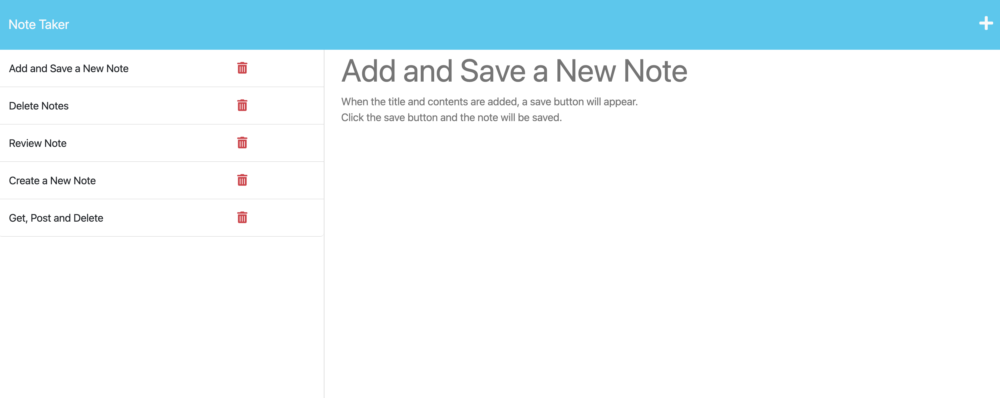
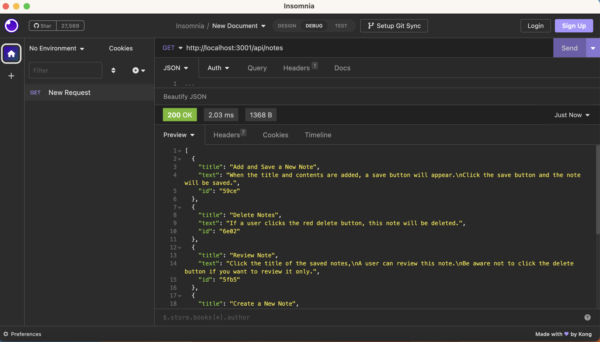

# A Note Taker App

## Description

This app is designed for writing and saving notes. It uses an Express.js back end and will save and retrieve note data from a JSON file. When a user inputs title and text, a save button appears and when the save button is clicked, the note is saved for future use. A user is allowed to add, review and delete notes in this app.

## Functions
#### Add and Save a New Note 
When the title and contents are added, a save button will appear.
Click the save button and the note will be saved.
#### Delete Notes
If a user clicks the red delete button, this note will be deleted.
#### Review Note
Click the title of the saved notes, a user can review this note.
Be aware not to click the delete button if you want to review it only.
#### Create a New Note
When a note is saved, a user will be shown a new blank note input area and the user may input new notes.
When reviewing a saved note, the user needs to click the '+' icon on the right top to create a new note.

## APIs
* `GET /notes` returns the `notes.html` file.
* `GET *` returns the `index.html` file.
* `GET /api/notes` reads the `db.json` file and returns all saved notes as JSON.
* `POST /api/notes` receives a new note to save on the request body, adds it to the `db.json` file, and then returns the new note to the client. 
* `DELETE /api/notes/:id` receives a query parameter that contains the id of a note to delete. To delete a note, you'll need to read all notes from the `db.json` file, remove the note with the given `id` property, and then rewrite the notes to the `db.json` file.

## Links
* The App https://new-note-taker.herokuapp.com/

* The code https://github.com/unbmattzhao/A_Note_Taker

## Screenshot

